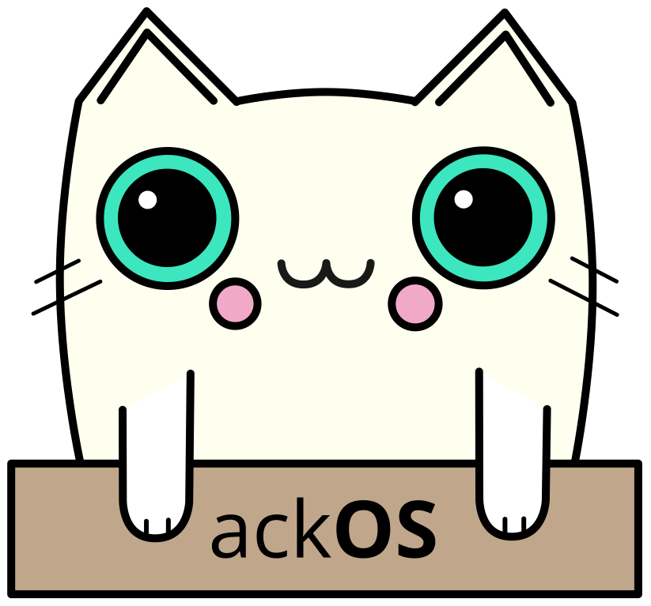

# ackOS

</img>

**ackOS** is a simple 64-bit operating system

## How do I build ackOS?
[click here for the build guide](manual/build.md)

## The state of ackOS
ackOS currently does not render anything to the screen; everything is printed to the serial ports. We're still working on things like memory management and basic kernel functions. [View the to do list here](TODO.md)

## Links
[Chat on Discord](https://discord.gg/f6WRY6sHqa)
